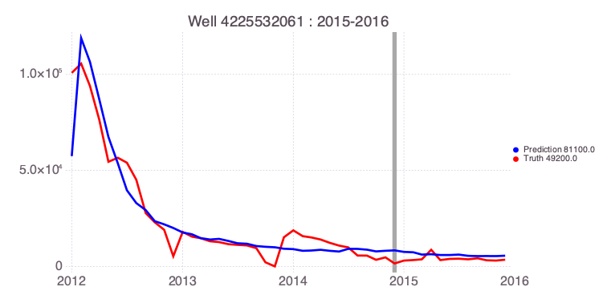
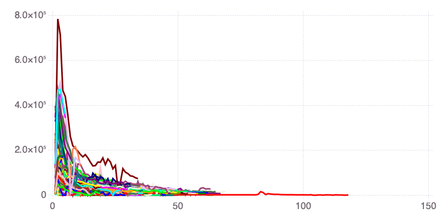
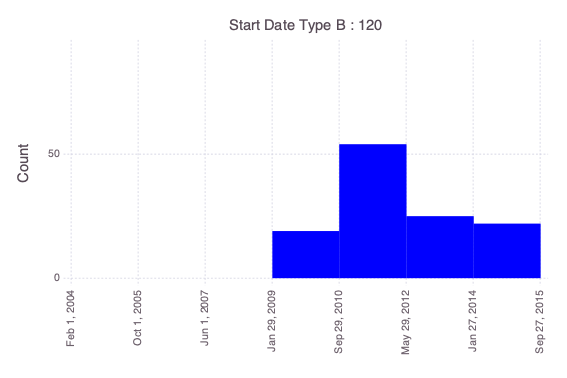
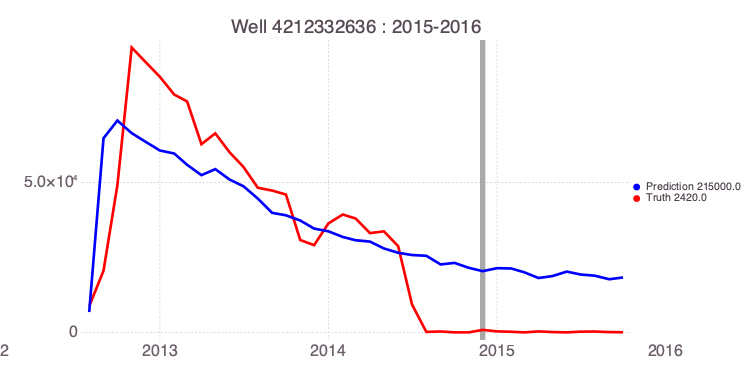
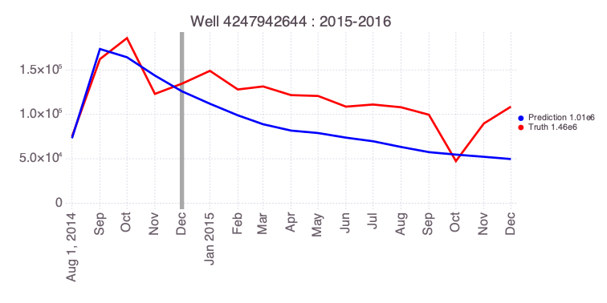

WellDataBaseML example: Predicting Well production within Eagle Ford Play 
---

A problem demonstrating how **WellDataBaseML** can be applied to predict oil/gas production.

The machine-lerning problem described here is related to the clasical history matching problems performed regularly for oil/gas exploration.

If **WellDataBaseML** is not installed, first execute `import Pkg; Pkg.add("WellDataBaseML"); Pkg.add("WellDataBase")`.

## Import WellDataBaseML


```julia
import WellDataBaseML
import WellDataBase
```

    ┌ Info: Precompiling WellDataBaseML [b2fc4b94-a46a-4cf9-bc84-39b1d777371f]
    └ @ Base loading.jl:1278


<script>
// Immediately-invoked-function-expression to avoid global variables.
(function() {
    var warning_div = document.getElementById("webio-warning-6604808866375988933");
    var hide = function () {
        var script = document.getElementById("webio-setup-14260064878864769296");
        var parent = script && script.parentElement;
        var grandparent = parent && parent.parentElement;
        if (grandparent) {
            grandparent.style.display = "none";
        }
        warning_div.style.display = "none";
    };
    if (typeof Jupyter !== "undefined") {
        console.log("WebIO detected Jupyter notebook environment.");
        // Jupyter notebook.
        var extensions = (
            Jupyter
            && Jupyter.notebook.config.data
            && Jupyter.notebook.config.data.load_extensions
        );
        if (extensions && extensions["webio-jupyter-notebook"]) {
            // Extension already loaded.
            console.log("Jupyter WebIO nbextension detected; not loading ad-hoc.");
            hide();
            return;
        }
    } else if (window.location.pathname.includes("/lab")) {
        // Guessing JupyterLa
        console.log("Jupyter Lab detected; make sure the @webio/jupyter-lab-provider labextension is installed.");
        hide();
        return;
    }
})();

</script>
<p
    id="webio-warning-6604808866375988933"
    class="output_text output_stderr"
    style="padding: 1em; font-weight: bold;"
>
    Unable to load WebIO. Please make sure WebIO works for your Jupyter client.
    For troubleshooting, please see <a href="https://juliagizmos.github.io/WebIO.jl/latest/providers/ijulia/">
    the WebIO/IJulia documentation</a>.
    <!-- TODO: link to installation docs. -->
</p>


    ┌ Info: Installing pyqt package to avoid buggy tkagg backend.
    └ @ PyPlot /Users/vvv/.julia/packages/PyPlot/XHEG0/src/init.jl:118


## Load Eagle Ford Play datasets


```julia
df, df_header, api, recordlength, dates = WellDataBase.read(["csv-201908102241", "csv-201908102238", "csv-201908102239"]; location="/Users/vvv/Julia/UnconventionalML.jl/data/eagleford-play-20191008", downselect=[:WellType=>"GAS", :Orientation=>"Horizontal"]);
```

    sers/vvv/Julia/WellDataBase.jl/src/WellDataBase.jl:199
    ┌ Info: Col 9 LastProdDate --> false
    └ @ WellDataBase /Users/vvv/Julia/WellDataBase.jl/src/WellDataBase.jl:199
    ┌ Info: Col 10 WellId --> false
    └ @ WellDataBase /Users/vvv/Julia/WellDataBase.jl/src/WellDataBase.jl:199
    ┌ Info: Col 11 WellName --> false
    └ @ WellDataBase /Users/vvv/Julia/WellDataBase.jl/src/WellDataBase.jl:199
    ┌ Info: Col 12 WellType --> true
    └ @ WellDataBase /Users/vvv/Julia/WellDataBase.jl/src/WellDataBase.jl:199
    ┌ Info: Col 13 WellStatus --> false
    └ @ WellDataBase /Users/vvv/Julia/WellDataBase.jl/src/WellDataBase.jl:199
    ┌ Info: Col 14 CurrentOperator --> false
    └ @ WellDataBase /Users/vvv/Julia/WellDataBase.jl/src/WellDataBase.jl:199
    ┌ Info: Col 15 OriginalOperator --> false
    └ @ WellDataBase /Users/vvv/Julia/WellDataBase.jl/src/WellDataBase.jl:199
    ┌ Info: Col 16 Field --> false
    └ @ WellDataBase /Users/vvv/Julia/WellDataBase.jl/src/WellDataBase.jl:199
    ┌ Info: Col 17 County --> false
    └ @ WellDataBase /Users/vvv/Julia/WellDataBase.jl/src/WellDataBase.jl:199
    ┌ Info: Col 18 State --> false
    └ @ WellDataBase /Users/vvv/Julia/WellDataBase.jl/src/WellDataBase.jl:199
    ┌ Info: Col 19 Country --> false
    └ @ WellDataBase /Users/vvv/Julia/WellDataBase.jl/src/WellDataBase.jl:199
    ┌ Info: Col 20 WellBoreProfile --> false
    └ @ WellDataBase /Users/vvv/Julia/WellDataBase.jl/src/WellDataBase.jl:199
    ┌ Info: Col 21 Latitude --> false
    └ @ WellDataBase /Users/vvv/Julia/WellDataBase.jl/src/WellDataBase.jl:199
    ┌ Info: Col 22 Longitude --> false
    └ @ WellDataBase /Users/vvv/Julia/WellDataBase.jl/src/WellDataBase.jl:199
    ┌ Info: Col 23 BHLatitude --> true
    └ @ WellDataBase /Users/vvv/Julia/WellDataBase.jl/src/WellDataBase.jl:199
    ┌ Info: Col 24 BHLongitude --> true
    └ @ WellDataBase /Users/vvv/Julia/WellDataBase.jl/src/WellDataBase.jl:199
    ┌ Info: Col 25 PermitDate --> false
    └ @ WellDataBase /Users/vvv/Julia/WellDataBase.jl/src/WellDataBase.jl:199
    ┌ Info: Col 26 SpudDate --> false
    └ @ WellDataBase /Users/vvv/Julia/WellDataBase.jl/src/WellDataBase.jl:199
    ┌ Info: Col 27 CompletionDate --> false
    └ @ WellDataBase /Users/vvv/Julia/WellDataBase.jl/src/WellDataBase.jl:199
    ┌ Info: Col 28 FirstProdDate --> false
    └ @ WellDataBase /Users/vvv/Julia/WellDataBase.jl/src/WellDataBase.jl:199
    ┌ Info: Col 29 MeasuredDepth --> false
    └ @ WellDataBase /Users/vvv/Julia/WellDataBase.jl/src/WellDataBase.jl:199
    ┌ Info: Col 30 TrueVerticalDepth --> true
    └ @ WellDataBase /Users/vvv/Julia/WellDataBase.jl/src/WellDataBase.jl:199
    ┌ Info: Col 31 LateralLength --> false
    └ @ WellDataBase /Users/vvv/Julia/WellDataBase.jl/src/WellDataBase.jl:199
    ┌ Info: Col 32 Basin --> false
    └ @ WellDataBase /Users/vvv/Julia/WellDataBase.jl/src/WellDataBase.jl:199
    ┌ Info: Col 33 Play --> false
    └ @ WellDataBase /Users/vvv/Julia/WellDataBase.jl/src/WellDataBase.jl:199
    ┌ Info: Col 34 Grid1 --> false
    └ @ WellDataBase /Users/vvv/Julia/WellDataBase.jl/src/WellDataBase.jl:199
    ┌ Info: Col 35 Grid2 --> false
    └ @ WellDataBase /Users/vvv/Julia/WellDataBase.jl/src/WellDataBase.jl:199
    ┌ Info: Col 36 Grid3 --> false
    └ @ WellDataBase /Users/vvv/Julia/WellDataBase.jl/src/WellDataBase.jl:199
    ┌ Info: Col 37 Grid4 --> false
    └ @ WellDataBase /Users/vvv/Julia/WellDataBase.jl/src/WellDataBase.jl:199
    ┌ Info: Col 38 Grid5 --> false
    └ @ WellDataBase /Users/vvv/Julia/WellDataBase.jl/src/WellDataBase.jl:199
    ┌ Info: Col 39 StateId --> false
    └ @ WellDataBase /Users/vvv/Julia/WellDataBase.jl/src/WellDataBase.jl:199
    ┌ Info: Col 40 StateIdDesc --> false
    └ @ WellDataBase /Users/vvv/Julia/WellDataBase.jl/src/WellDataBase.jl:199
    ┌ Info: Col 41 ThermalMaturity --> false
    └ @ WellDataBase /Users/vvv/Julia/WellDataBase.jl/src/WellDataBase.jl:199
    ┌ Info: Col 42 Id --> false
    └ @ WellDataBase /Users/vvv/Julia/WellDataBase.jl/src/WellDataBase.jl:199
    ┌ Info: Col 43 PlugDate --> false
    └ @ WellDataBase /Users/vvv/Julia/WellDataBase.jl/src/WellDataBase.jl:199
    ┌ Info: Col 44 PermitNumber --> false
    └ @ WellDataBase /Users/vvv/Julia/WellDataBase.jl/src/WellDataBase.jl:199
    ┌ Info: Col 45 Lease --> false
    └ @ WellDataBase /Users/vvv/Julia/WellDataBase.jl/src/WellDataBase.jl:199
    ┌ Info: Col 46 LeaseId --> false
    └ @ WellDataBase /Users/vvv/Julia/WellDataBase.jl/src/WellDataBase.jl:199
    ┌ Info: Col 47 Footages --> false
    └ @ WellDataBase /Users/vvv/Julia/WellDataBase.jl/src/WellDataBase.jl:199
    ┌ Info: Col 48 Quarter --> false
    └ @ WellDataBase /Users/vvv/Julia/WellDataBase.jl/src/WellDataBase.jl:199
    ┌ Info: Col 49 GroundElevation --> false
    └ @ WellDataBase /Users/vvv/Julia/WellDataBase.jl/src/WellDataBase.jl:199
    ┌ Info: Col 50 DrillingFloorElevation --> false
    └ @ WellDataBase /Users/vvv/Julia/WellDataBase.jl/src/WellDataBase.jl:199
    ┌ Info: Col 51 KellyBushingElevation --> false
    └ @ WellDataBase /Users/vvv/Julia/WellDataBase.jl/src/WellDataBase.jl:199
    ┌ Info: Col 52 Comments --> false
    └ @ WellDataBase /Users/vvv/Julia/WellDataBase.jl/src/WellDataBase.jl:199
    ┌ Info: Col 53 TestDate --> false
    └ @ WellDataBase /Users/vvv/Julia/WellDataBase.jl/src/WellDataBase.jl:199
    ┌ Info: Col 54 PrimaryFormation --> true
    └ @ WellDataBase /Users/vvv/Julia/WellDataBase.jl/src/WellDataBase.jl:199
    ┌ Info: Col 55 ReportedCurrentOperator --> true
    └ @ WellDataBase /Users/vvv/Julia/WellDataBase.jl/src/WellDataBase.jl:199
    ┌ Info: Col 56 ReportedOriginalOperator --> false
    └ @ WellDataBase /Users/vvv/Julia/WellDataBase.jl/src/WellDataBase.jl:199
    ┌ Info: Col 57 ReportedField --> false
    └ @ WellDataBase /Users/vvv/Julia/WellDataBase.jl/src/WellDataBase.jl:199
    ┌ Info: Col 58 ReportedWellboreProfile --> true
    └ @ WellDataBase /Users/vvv/Julia/WellDataBase.jl/src/WellDataBase.jl:199
    ┌ Info: Col 59 WellNumber --> false
    └ @ WellDataBase /Users/vvv/Julia/WellDataBase.jl/src/WellDataBase.jl:199
    ┌ Info: Col 60 OffshoreWaterDepth --> false
    └ @ WellDataBase /Users/vvv/Julia/WellDataBase.jl/src/WellDataBase.jl:199
    ┌ Info: File: /Users/vvv/Julia/UnconventionalML.jl/data/eagleford-play-20191008/csv-201908102241/csv-201908102241-Production.csv
    └ @ WellDataBase /Users/vvv/Julia/WellDataBase.jl/src/WellDataBase.jl:19
    ┌ Info: Column 1: API Type: Int64 Number of missing entries: 0
    └ @ WellDataBase /Users/vvv/Julia/WellDataBase.jl/src/WellDataBase.jl:26
    ┌ Info: Column 2: WellName Type: String Number of missing entries: 0 SKIPPED!
    └ @ WellDataBase /Users/vvv/Julia/WellDataBase.jl/src/WellDataBase.jl:46
    ┌ Info: Column 3: Id Type: String Number of missing entries: 0 SKIPPED!
    └ @ WellDataBase /Users/vvv/Julia/WellDataBase.jl/src/WellDataBase.jl:46
    ┌ Info: Column 4: WellId Type: String Number of missing entries: 0 SKIPPED!
    └ @ WellDataBase /Users/vvv/Julia/WellDataBase.jl/src/WellDataBase.jl:46
    ┌ Info: Column 5: ReportDate Type: Dates.Date Number of missing entries: 0
    └ @ WellDataBase /Users/vvv/Julia/WellDataBase.jl/src/WellDataBase.jl:26
    ┌ Info: Column 6: Days Type: Int32 Number of missing entries: 0 SKIPPED!
    └ @ WellDataBase /Users/vvv/Julia/WellDataBase.jl/src/WellDataBase.jl:46
    ┌ Info: Column 7: Lease Type: Int32 Number of missing entries: 110 SKIPPED!
    └ @ WellDataBase /Users/vvv/Julia/WellDataBase.jl/src/WellDataBase.jl:46
    ┌ Info: Column 8: Operator Type: String Number of missing entries: 1330 SKIPPED!
    └ @ WellDataBase /Users/vvv/Julia/WellDataBase.jl/src/WellDataBase.jl:46
    ┌ Info: Column 9: WellsInLease Type: Int32 Number of missing entries: 21 SKIPPED!
    └ @ WellDataBase /Users/vvv/Julia/WellDataBase.jl/src/WellDataBase.jl:46
    ┌ Info: Column 10: Field Type: String Number of missing entries: 3863 SKIPPED!
    └ @ WellDataBase /Users/vvv/Julia/WellDataBase.jl/src/WellDataBase.jl:46
    ┌ Info: Column 11: Formation Type: String Number of missing entries: 1291 SKIPPED!
    └ @ WellDataBase /Users/vvv/Julia/WellDataBase.jl/src/WellDataBase.jl:46
    ┌ Info: Column 12: TotalOil Type: Float32 Number of missing entries: 306 SKIPPED!
    └ @ WellDataBase /Users/vvv/Julia/WellDataBase.jl/src/WellDataBase.jl:46
    ┌ Info: Column 13: LeaseOilAllowable Type: Float32 Number of missing entries: 66765 SKIPPED!
    └ @ WellDataBase /Users/vvv/Julia/WellDataBase.jl/src/WellDataBase.jl:46
    ┌ Info: Column 14: WellOilAllowable Type: Float32 Number of missing entries: 83771 SKIPPED!
    └ @ WellDataBase /Users/vvv/Julia/WellDataBase.jl/src/WellDataBase.jl:46
    ┌ Info: Column 15: WellOil Type: Float32 Number of missing entries: 649
    └ @ WellDataBase /Users/vvv/Julia/WellDataBase.jl/src/WellDataBase.jl:26
    ┌ Info: Column 16: TotalGas Type: Float32 Number of missing entries: 3042 SKIPPED!
    └ @ WellDataBase /Users/vvv/Julia/WellDataBase.jl/src/WellDataBase.jl:46
    ┌ Info: Column 17: LeaseGasAllowable Type: Float32 Number of missing entries: 68620 SKIPPED!
    └ @ WellDataBase /Users/vvv/Julia/WellDataBase.jl/src/WellDataBase.jl:46
    ┌ Info: Column 18: WellGasAllowable Type: Float32 Number of missing entries: 83722 SKIPPED!
    └ @ WellDataBase /Users/vvv/Julia/WellDataBase.jl/src/WellDataBase.jl:46
    ┌ Info: Column 19: WellGas Type: Float32 Number of missing entries: 3378
    └ @ WellDataBase /Users/vvv/Julia/WellDataBase.jl/src/WellDataBase.jl:26
    ┌ Info: Column 20: TotalWater Type: Float32 Number of missing entries: 95 SKIPPED!
    └ @ WellDataBase /Users/vvv/Julia/WellDataBase.jl/src/WellDataBase.jl:46
    ┌ Info: Column 21: WellWater Type: Float32 Number of missing entries: 93
    └ @ WellDataBase /Users/vvv/Julia/WellDataBase.jl/src/WellDataBase.jl:26
    ┌ Info: Column 22: GOR Type: Float32 Number of missing entries: 3512 SKIPPED!
    └ @ WellDataBase /Users/vvv/Julia/WellDataBase.jl/src/WellDataBase.jl:46
    ┌ Info: Column 23: ReportMonth Type: Int32 Number of missing entries: 0 SKIPPED!
    └ @ WellDataBase /Users/vvv/Julia/WellDataBase.jl/src/WellDataBase.jl:46
    ┌ Info: Column 24: ReportYear Type: Int32 Number of missing entries: 0 SKIPPED!
    └ @ WellDataBase /Users/vvv/Julia/WellDataBase.jl/src/WellDataBase.jl:46
    ┌ Info: Column 25: ReportedOperator Type: String Number of missing entries: 1330 SKIPPED!
    └ @ WellDataBase /Users/vvv/Julia/WellDataBase.jl/src/WellDataBase.jl:46
    ┌ Info: Column 26: ReportedFormation Type: String Number of missing entries: 2666 SKIPPED!
    └ @ WellDataBase /Users/vvv/Julia/WellDataBase.jl/src/WellDataBase.jl:46
    ┌ Info: Column 27: InterpretedFormation Type: String Number of missing entries: 177721 SKIPPED!
    └ @ WellDataBase /Users/vvv/Julia/WellDataBase.jl/src/WellDataBase.jl:46
    ┌ Info: File: /Users/vvv/Julia/UnconventionalML.jl/data/eagleford-play-20191008/csv-201908102238/csv-201908102238-Production.csv
    └ @ WellDataBase /Users/vvv/Julia/WellDataBase.jl/src/WellDataBase.jl:19
    ┌ Info: Column 1: API Type: Int64 Number of missing entries: 0
    └ @ WellDataBase /Users/vvv/Julia/WellDataBase.jl/src/WellDataBase.jl:26
    ┌ Info: Column 2: WellName Type: String Number of missing entries: 0 SKIPPED!
    └ @ WellDataBase /Users/vvv/Julia/WellDataBase.jl/src/WellDataBase.jl:46
    ┌ Info: Column 3: Id Type: String Number of missing entries: 0 SKIPPED!
    └ @ WellDataBase /Users/vvv/Julia/WellDataBase.jl/src/WellDataBase.jl:46
    ┌ Info: Column 4: WellId Type: String Number of missing entries: 0 SKIPPED!
    └ @ WellDataBase /Users/vvv/Julia/WellDataBase.jl/src/WellDataBase.jl:46
    ┌ Info: Column 5: ReportDate Type: Dates.Date Number of missing entries: 0
    └ @ WellDataBase /Users/vvv/Julia/WellDataBase.jl/src/WellDataBase.jl:26
    ┌ Info: Column 6: Days Type: Int32 Number of missing entries: 0 SKIPPED!
    └ @ WellDataBase /Users/vvv/Julia/WellDataBase.jl/src/WellDataBase.jl:46
    ┌ Info: Column 7: Lease Type: Int32 Number of missing entries: 179 SKIPPED!
    └ @ WellDataBase /Users/vvv/Julia/WellDataBase.jl/src/WellDataBase.jl:46
    ┌ Info: Column 8: Operator Type: String Number of missing entries: 2279 SKIPPED!
    └ @ WellDataBase /Users/vvv/Julia/WellDataBase.jl/src/WellDataBase.jl:46
    ┌ Info: Column 9: WellsInLease Type: Int32 Number of missing entries: 127 SKIPPED!
    └ @ WellDataBase /Users/vvv/Julia/WellDataBase.jl/src/WellDataBase.jl:46
    ┌ Info: Column 10: Field Type: String Number of missing entries: 356 SKIPPED!
    └ @ WellDataBase /Users/vvv/Julia/WellDataBase.jl/src/WellDataBase.jl:46
    ┌ Info: Column 11: Formation Type: String Number of missing entries: 1377 SKIPPED!
    └ @ WellDataBase /Users/vvv/Julia/WellDataBase.jl/src/WellDataBase.jl:46
    ┌ Info: Column 12: TotalOil Type: Float32 Number of missing entries: 227 SKIPPED!
    └ @ WellDataBase /Users/vvv/Julia/WellDataBase.jl/src/WellDataBase.jl:46
    ┌ Info: Column 13: LeaseOilAllowable Type: Float32 Number of missing entries: 234246 SKIPPED!
    └ @ WellDataBase /Users/vvv/Julia/WellDataBase.jl/src/WellDataBase.jl:46
    ┌ Info: Column 14: WellOilAllowable Type: Float32 Number of missing entries: 292927 SKIPPED!
    └ @ WellDataBase /Users/vvv/Julia/WellDataBase.jl/src/WellDataBase.jl:46
    ┌ Info: Column 15: WellOil Type: Float32 Number of missing entries: 710
    └ @ WellDataBase /Users/vvv/Julia/WellDataBase.jl/src/WellDataBase.jl:26
    ┌ Info: Column 16: TotalGas Type: Float32 Number of missing entries: 49 SKIPPED!
    └ @ WellDataBase /Users/vvv/Julia/WellDataBase.jl/src/WellDataBase.jl:46
    ┌ Info: Column 17: LeaseGasAllowable Type: Float32 Number of missing entries: 234246 SKIPPED!
    └ @ WellDataBase /Users/vvv/Julia/WellDataBase.jl/src/WellDataBase.jl:46
    ┌ Info: Column 18: WellGasAllowable Type: Float32 Number of missing entries: 292927 SKIPPED!
    └ @ WellDataBase /Users/vvv/Julia/WellDataBase.jl/src/WellDataBase.jl:46
    ┌ Info: Column 19: WellGas Type: Float32 Number of missing entries: 525
    └ @ WellDataBase /Users/vvv/Julia/WellDataBase.jl/src/WellDataBase.jl:26
    ┌ Info: Column 20: TotalWater Type: Float32 Number of missing entries: 134 SKIPPED!
    └ @ WellDataBase /Users/vvv/Julia/WellDataBase.jl/src/WellDataBase.jl:46
    ┌ Info: Column 21: WellWater Type: Float32 Number of missing entries: 128
    └ @ WellDataBase /Users/vvv/Julia/WellDataBase.jl/src/WellDataBase.jl:26
    ┌ Info: Column 22: GOR Type: Float32 Number of missing entries: 44 SKIPPED!
    └ @ WellDataBase /Users/vvv/Julia/WellDataBase.jl/src/WellDataBase.jl:46
    ┌ Info: Column 23: ReportMonth Type: Int32 Number of missing entries: 0 SKIPPED!
    └ @ WellDataBase /Users/vvv/Julia/WellDataBase.jl/src/WellDataBase.jl:46
    ┌ Info: Column 24: ReportYear Type: Int32 Number of missing entries: 0 SKIPPED!
    └ @ WellDataBase /Users/vvv/Julia/WellDataBase.jl/src/WellDataBase.jl:46
    ┌ Info: Column 25: ReportedOperator Type: String Number of missing entries: 2279 SKIPPED!
    └ @ WellDataBase /Users/vvv/Julia/WellDataBase.jl/src/WellDataBase.jl:46
    ┌ Info: Column 26: ReportedFormation Type: String Number of missing entries: 1608 SKIPPED!
    └ @ WellDataBase /Users/vvv/Julia/WellDataBase.jl/src/WellDataBase.jl:46
    ┌ Info: Column 27: InterpretedFormation Type: String Number of missing entries: 574621 SKIPPED!
    └ @ WellDataBase /Users/vvv/Julia/WellDataBase.jl/src/WellDataBase.jl:46
    ┌ Info: File: /Users/vvv/Julia/UnconventionalML.jl/data/eagleford-play-20191008/csv-201908102239/csv-201908102239-Production.csv
    └ @ WellDataBase /Users/vvv/Julia/WellDataBase.jl/src/WellDataBase.jl:19
    ┌ Info: Column 1: API Type: Int64 Number of missing entries: 0
    └ @ WellDataBase /Users/vvv/Julia/WellDataBase.jl/src/WellDataBase.jl:26
    ┌ Info: Column 2: WellName Type: String Number of missing entries: 0 SKIPPED!
    └ @ WellDataBase /Users/vvv/Julia/WellDataBase.jl/src/WellDataBase.jl:46
    ┌ Info: Column 3: Id Type: String Number of missing entries: 0 SKIPPED!
    └ @ WellDataBase /Users/vvv/Julia/WellDataBase.jl/src/WellDataBase.jl:46
    ┌ Info: Column 4: WellId Type: String Number of missing entries: 0 SKIPPED!
    └ @ WellDataBase /Users/vvv/Julia/WellDataBase.jl/src/WellDataBase.jl:46
    ┌ Info: Column 5: ReportDate Type: Dates.Date Number of missing entries: 0
    └ @ WellDataBase /Users/vvv/Julia/WellDataBase.jl/src/WellDataBase.jl:26
    ┌ Info: Column 6: Days Type: Int32 Number of missing entries: 0 SKIPPED!
    └ @ WellDataBase /Users/vvv/Julia/WellDataBase.jl/src/WellDataBase.jl:46
    ┌ Info: Column 7: Lease Type: Int32 Number of missing entries: 186 SKIPPED!
    └ @ WellDataBase /Users/vvv/Julia/WellDataBase.jl/src/WellDataBase.jl:46
    ┌ Info: Column 8: Operator Type: String Number of missing entries: 1152 SKIPPED!
    └ @ WellDataBase /Users/vvv/Julia/WellDataBase.jl/src/WellDataBase.jl:46
    ┌ Info: Column 9: WellsInLease Type: Int32 Number of missing entries: 156 SKIPPED!
    └ @ WellDataBase /Users/vvv/Julia/WellDataBase.jl/src/WellDataBase.jl:46
    ┌ Info: Column 10: Field Type: String Number of missing entries: 199 SKIPPED!
    └ @ WellDataBase /Users/vvv/Julia/WellDataBase.jl/src/WellDataBase.jl:46
    ┌ Info: Column 11: Formation Type: String Number of missing entries: 2870 SKIPPED!
    └ @ WellDataBase /Users/vvv/Julia/WellDataBase.jl/src/WellDataBase.jl:46
    ┌ Info: Column 12: TotalOil Type: Float32 Number of missing entries: 403 SKIPPED!
    └ @ WellDataBase /Users/vvv/Julia/WellDataBase.jl/src/WellDataBase.jl:46
    ┌ Info: Column 13: LeaseOilAllowable Type: Float32 Number of missing entries: 203835 SKIPPED!
    └ @ WellDataBase /Users/vvv/Julia/WellDataBase.jl/src/WellDataBase.jl:46
    ┌ Info: Column 14: WellOilAllowable Type: Float32 Number of missing entries: 266149 SKIPPED!
    └ @ WellDataBase /Users/vvv/Julia/WellDataBase.jl/src/WellDataBase.jl:46
    ┌ Info: Column 15: WellOil Type: Float32 Number of missing entries: 637
    └ @ WellDataBase /Users/vvv/Julia/WellDataBase.jl/src/WellDataBase.jl:26
    ┌ Info: Column 16: TotalGas Type: Float32 Number of missing entries: 359 SKIPPED!
    └ @ WellDataBase /Users/vvv/Julia/WellDataBase.jl/src/WellDataBase.jl:46
    ┌ Info: Column 17: LeaseGasAllowable Type: Float32 Number of missing entries: 203835 SKIPPED!
    └ @ WellDataBase /Users/vvv/Julia/WellDataBase.jl/src/WellDataBase.jl:46
    ┌ Info: Column 18: WellGasAllowable Type: Float32 Number of missing entries: 266149 SKIPPED!
    └ @ WellDataBase /Users/vvv/Julia/WellDataBase.jl/src/WellDataBase.jl:46
    ┌ Info: Column 19: WellGas Type: Float32 Number of missing entries: 589
    └ @ WellDataBase /Users/vvv/Julia/WellDataBase.jl/src/WellDataBase.jl:26
    ┌ Info: Column 20: TotalWater Type: Float32 Number of missing entries: 194 SKIPPED!
    └ @ WellDataBase /Users/vvv/Julia/WellDataBase.jl/src/WellDataBase.jl:46
    ┌ Info: Column 21: WellWater Type: Float32 Number of missing entries: 195
    └ @ WellDataBase /Users/vvv/Julia/WellDataBase.jl/src/WellDataBase.jl:26
    ┌ Info: Column 22: GOR Type: Float32 Number of missing entries: 287 SKIPPED!
    └ @ WellDataBase /Users/vvv/Julia/WellDataBase.jl/src/WellDataBase.jl:46
    ┌ Info: Column 23: ReportMonth Type: Int32 Number of missing entries: 0 SKIPPED!
    └ @ WellDataBase /Users/vvv/Julia/WellDataBase.jl/src/WellDataBase.jl:46
    ┌ Info: Column 24: ReportYear Type: Int32 Number of missing entries: 0 SKIPPED!
    └ @ WellDataBase /Users/vvv/Julia/WellDataBase.jl/src/WellDataBase.jl:46
    ┌ Info: Column 25: ReportedOperator Type: String Number of missing entries: 1152 SKIPPED!
    └ @ WellDataBase /Users/vvv/Julia/WellDataBase.jl/src/WellDataBase.jl:46
    ┌ Info: Column 26: ReportedFormation Type: String Number of missing entries: 2950 SKIPPED!
    └ @ WellDataBase /Users/vvv/Julia/WellDataBase.jl/src/WellDataBase.jl:46
    ┌ Info: Column 27: InterpretedFormation Type: String Number of missing entries: 505872 SKIPPED!
    └ @ WellDataBase /Users/vvv/Julia/WellDataBase.jl/src/WellDataBase.jl:46
    ┌ Info: Number of wells: 20805
    └ @ WellDataBase /Users/vvv/Julia/WellDataBase.jl/src/WellDataBase.jl:59
    ┌ Info: Record start date: 1940-01-01
    └ @ WellDataBase /Users/vvv/Julia/WellDataBase.jl/src/WellDataBase.jl:112
    ┌ Info: Record end  date: 2019-06-01
    └ @ WellDataBase /Users/vvv/Julia/WellDataBase.jl/src/WellDataBase.jl:113
    ┌ Info: Max record length: 861 months
    └ @ WellDataBase /Users/vvv/Julia/WellDataBase.jl/src/WellDataBase.jl:114
    ┌ Info: Long well: 4249900785 (20498)
    └ @ WellDataBase /Users/vvv/Julia/WellDataBase.jl/src/WellDataBase.jl:115
    ┌ Info: Number of good wells: 561
    └ @ WellDataBase /Users/vvv/Julia/WellDataBase.jl/src/WellDataBase.jl:137
    ┌ Info: Record start date: 2004-02-01
    └ @ WellDataBase /Users/vvv/Julia/WellDataBase.jl/src/WellDataBase.jl:139
    ┌ Info: Record end  date: 2019-06-01
    └ @ WellDataBase /Users/vvv/Julia/WellDataBase.jl/src/WellDataBase.jl:140
    ┌ Info: Max record length: 185 months
    └ @ WellDataBase /Users/vvv/Julia/WellDataBase.jl/src/WellDataBase.jl:141
    ┌ Info: Long well: 4247938581 (203)
    └ @ WellDataBase /Users/vvv/Julia/WellDataBase.jl/src/WellDataBase.jl:142


The loaded data are provided in the follwoing form: 

- `df`: data frame containing well production transients
- `df_header`: data frame containing well construction attributes
- `api`: a vector with well API's listed in `df` and df_header`
- `recordlength`: the maximum record lenght (in months) for the processed well dataset
- `dates`: range of dates for which produciton data are availables (in months)

## Machine learning (ML) analysis

Machine learning (ML) analysis can be performed to predict well production based on this dataset.

Under this example, the goal is to use all the data collected up to 2015 for training.

After that, the applied ML methodology performs blind prediction for 1 year ahead (2015-2016).

### Setup training prediction / prediction dates


```julia
syears = [2015]
eyears = syears .+ 1;
```

- `syears`: start dates for prediction; data before the start date for prediction is used for training
- `eyears`: end dates for prediction; data after the end is ignored

### Execute ML run

ML analyses is excuted as follows:


```julia
WellDataBaseML.execute(syears, eyears, df, df_header, api; workdir="/Users/vvv/Julia/UnconventionalML.jl", plotseries=true)
```


    

    


    ┌ Info: 2015: Number of wells 322
    └ @ NMFk /Users/vvv/.julia/dev/NMFk/src/NMFkProgressive.jl:122
    ┌ Info: Training matrix size: (118, 322)
    └ @ NMFk /Users/vvv/.julia/dev/NMFk/src/NMFkProgressive.jl:137


    

    


    ┌ Info: Training start date: 2004-02-01
    └ @ NMFk /Users/vvv/.julia/dev/NMFk/src/NMFkProgressive.jl:138
    ┌ Info: Training end   date: 2004-02-01
    └ @ NMFk /Users/vvv/.julia/dev/NMFk/src/NMFkProgressive.jl:139


    

    


    ┌ Info: Prediction matrix size: (143, 322)
    └ @ NMFk /Users/vvv/.julia/dev/NMFk/src/NMFkProgressive.jl:144
    ┌ Info: Prediction start date: 2004-02-01
    └ @ NMFk /Users/vvv/.julia/dev/NMFk/src/NMFkProgressive.jl:145
    ┌ Info: Prediction end   date: 2004-02-01
    └ @ NMFk /Users/vvv/.julia/dev/NMFk/src/NMFkProgressive.jl:146
    ┌ Info: Training window: 118
    └ @ NMFk /Users/vvv/.julia/dev/NMFk/src/NMFkProgressive.jl:156
    ┌ Info: Prediction window: 25
    └ @ NMFk /Users/vvv/.julia/dev/NMFk/src/NMFkProgressive.jl:157
    Dimension 1: No bad indices!
    Dimension 2: No bad indices!
    ┌ Info: Dimension 1 ...
    └ @ NMFk /Users/vvv/.julia/dev/NMFk/src/NMFkChecks.jl:78
    ┌ Info: Dimension 2 ...
    └ @ NMFk /Users/vvv/.julia/dev/NMFk/src/NMFkChecks.jl:78
    ┌ Info: NMFk #1: gas_2015 Window 118
    └ @ NMFk /Users/vvv/.julia/dev/NMFk/src/NMFkProgressive.jl:65
    Signals:  2 Fit: 3.739159e+12 Silhouette:    0.1872708 AIC:     214955.6
    Signals:  3 Fit: 2.436588e+12 Silhouette:    0.5115209 AIC:     211191.1
    Signals:  4 Fit: 1.811994e+12 Silhouette:    0.1589268 AIC:     208859.1
    Signals:  5 Fit: 1.341023e+12 Silhouette:   -0.2316457 AIC:     206474.8
    Signals:  2 Fit: 3.739159e+12 Silhouette:    0.1872708 AIC:     214955.6
    Signals:  3 Fit: 2.436588e+12 Silhouette:    0.5115209 AIC:     211191.1
    Signals:  4 Fit: 1.811994e+12 Silhouette:    0.1589268 AIC:     208859.1
    Signals:  5 Fit: 1.341023e+12 Silhouette:   -0.2316457 AIC:     206474.8
    ┌ Info: Results
    └ @ NMFk /Users/vvv/.julia/dev/NMFk/src/NMFkExecute.jl:15
    ┌ Info: Optimal solution: 3 signals
    └ @ NMFk /Users/vvv/.julia/dev/NMFk/src/NMFkExecute.jl:20
    ┌ Info: Optimal number of signals: [2, 3] Training window sizes: [118, 118]
    └ @ NMFk /Users/vvv/.julia/dev/NMFk/src/NMFkProgressive.jl:163


    

    


    Signals:  2 Fit: 3.739159e+12 Silhouette:    0.1872708 AIC:     214955.6


    

    


    


    

    


    

    


    


    

    


    

    


    


    

    


    

    


    


    

    


    

    


    


    

    


    

    


    


    

    


    

    


    


    

    


    

    


    


    

    


    

    


    


    

    


    

    


    


    

    


    

    


    


    

    


    

    


    


    

    


    

    


    


    

    


    

    


    


    

    


    

    


    ┌ Info: Window 2015: Training size 118 Truth size: 299 Prediction size: 299 R2 (pred): 0.6957154770204516 R2 (all) 0.8702610728541793
    └ @ NMFk /Users/vvv/.julia/dev/NMFk/src/NMFkProgressive.jl:221
    ┌ Info: Type A wells: 202
    └ @ NMFk /Users/vvv/.julia/dev/NMFk/src/NMFkProgressive.jl:235


    

    


    

    


    ┌ Info: Type B wells: 120
    └ @ NMFk /Users/vvv/.julia/dev/NMFk/src/NMFkProgressive.jl:235


    1×2 Array{Any,2}:
     "EAGLE FORD"  202


    ┌ Info: Type A wells: 202
    └ @ NMFk /Users/vvv/.julia/dev/NMFk/src/NMFkProgressive.jl:241
    ┌ Info: Formation
    └ @ NMFk /Users/vvv/.julia/dev/NMFk/src/NMFkProgressive.jl:242


    23×2 Array{Any,2}:
     "SILVERBOW RESOURCES OPER, LLC"     27
     "LAREDO ENERGY OPERATING, LLC"      21
     "PIONEER NATURAL RES. USA, INC."    18
     "SM ENERGY COMPANY"                 15
     "LEWIS PETRO PROPERTIES, INC."      14
     "SN OPERATING, LLC"                 11
     "ROSETTA RESOURCES OPERATING LP"     9
     "BHP BILLITON PET(TXLA OP) CO"       8
     "BHP BILLITON PETROLEUM"             8
     ""                                   6
     "BHP BILLITON PETROLEUM "            6
     "BURLINGTON RESOURCES O & G CO LP"   6
     "DEVON ENERGY PRODUCTION CO, L.P."   6
     "ESCONDIDO RESOURCES OPER CO, LLC"   6
     "MARATHON OIL EF LLC"                6
     "STATOIL TEXAS ONSHORE PROP LLC"     6
     "ENCANA OIL & GAS(USA) INC."         4
     "EQUINOR TEXAS ONSHORE PROP LLC"     4
     "PROLINE ENERGY RESOURCES INC"       3
     "SWIFT ENERGY OPERATING, LLC"        3
     "EOG RESOURCES, INC."                2
     "PERDIDO ENERGY, LLC"                2
     "ZAZA ENERGY, LLC"                   2


    1×2 Array{Any,2}:
     "Horizontal"  202


    1×2 Array{Any,2}:
     "EAGLE FORD"  120


    19×2 Array{Any,2}:
     "LEWIS PETRO PROPERTIES, INC."      32
     "SM ENERGY COMPANY"                 11
     "PIONEER NATURAL RES. USA, INC."    10
     "BHP BILLITON PET(TXLA OP) CO"       7
     "BURLINGTON RESOURCES O & G CO LP"   7
     "DEVON ENERGY PRODUCTION CO, L.P."   7
     "SILVERBOW RESOURCES OPER, LLC"      7
     "MARATHON OIL EF LLC"                4
     "SN OPERATING, LLC"                  4
     "STATOIL TEXAS ONSHORE PROP LLC"     4
     "ENDEAVOR NATURAL GAS, LP"           3
     "LAREDO ENERGY OPERATING, LLC"       3
     "PERDIDO ENERGY, LLC"                3
     ""                                   2
     "BHP BILLITON PETROLEUM"             2
     "BHP BILLITON PETROLEUM "            2
     "ESCONDIDO RESOURCES OPER CO, LLC"   2
     "FASKEN OIL AND RANCH, LTD."         2
     "ROSETTA RESOURCES OPERATING LP"     2


    1×2 Array{Any,2}:
     "Horizontal"  120


    

    


    ┌ Info: Operator
    └ @ NMFk /Users/vvv/.julia/dev/NMFk/src/NMFkProgressive.jl:244
    ┌ Info: Well type
    └ @ NMFk /Users/vvv/.julia/dev/NMFk/src/NMFkProgressive.jl:246
    ┌ Info: Type B wells: 120
    └ @ NMFk /Users/vvv/.julia/dev/NMFk/src/NMFkProgressive.jl:241
    ┌ Info: Formation
    └ @ NMFk /Users/vvv/.julia/dev/NMFk/src/NMFkProgressive.jl:242
    ┌ Info: Operator
    └ @ NMFk /Users/vvv/.julia/dev/NMFk/src/NMFkProgressive.jl:244
    ┌ Info: Well type
    └ @ NMFk /Users/vvv/.julia/dev/NMFk/src/NMFkProgressive.jl:246


    

    


    


    

    


    

    


    


    

    


    Signals:  3 Fit: 2.436588e+12 Silhouette:    0.5115209 AIC:     211191.1


    

    


    


    

    


    

    


    


    

    


    

    


    


    

    


    

    


    


    

    


    

    


    


    

    


    

    


    


    

    


    

    


    


    

    


    

    


    


    

    


    

    


    


    

    


    

    


    


    

    


    

    


    


    

    


    

    


    


    

    


    

    


    


    

    


    

    


    


    

    


    

    


    


    

    


    

    


    ┌ Info: Window 2015: Training size 118 Truth size: 299 Prediction size: 299 R2 (pred): 0.8650471996037531 R2 (all) 0.9506983925448549
    └ @ NMFk /Users/vvv/.julia/dev/NMFk/src/NMFkProgressive.jl:221
    ┌ Info: Type A wells: 141
    └ @ NMFk /Users/vvv/.julia/dev/NMFk/src/NMFkProgressive.jl:235


    

    


    ┌ Info: Type B wells: 94
    └ @ NMFk /Users/vvv/.julia/dev/NMFk/src/NMFkProgressive.jl:235


    

    


    ┌ Info: Type C wells: 87
    └ @ NMFk /Users/vvv/.julia/dev/NMFk/src/NMFkProgressive.jl:235


    1×2 Array{Any,2}:
     "EAGLE FORD"  141


    21×2 Array{Any,2}:
     "LEWIS PETRO PROPERTIES, INC."      18
     "SILVERBOW RESOURCES OPER, LLC"     16
     "SM ENERGY COMPANY"                 12
     "PIONEER NATURAL RES. USA, INC."    11
     "LAREDO ENERGY OPERATING, LLC"       9
     "SN OPERATING, LLC"                  8
     "MARATHON OIL EF LLC"                7
     "BHP BILLITON PET(TXLA OP) CO"       6
     "DEVON ENERGY PRODUCTION CO, L.P."   6
     "STATOIL TEXAS ONSHORE PROP LLC"     5
     ""                                   4
     "BHP BILLITON PETROLEUM"             4
     "BURLINGTON RESOURCES O & G CO LP"   4
     "ENDEAVOR NATURAL GAS, LP"           4
     "ESCONDIDO RESOURCES OPER CO, LLC"   4
     "ROSETTA RESOURCES OPERATING LP"     4
     "BHP BILLITON PETROLEUM "            3
     "ENCANA OIL & GAS(USA) INC."         2
     "EQUINOR TEXAS ONSHORE PROP LLC"     2
     "PERDIDO ENERGY, LLC"                2
     "PROLINE ENERGY RESOURCES INC"       2


    1×2 Array{Any,2}:
     "Horizontal"  141


    1×2 Array{Any,2}:
     "EAGLE FORD"  94


    18×2 Array{Any,2}:
     "LAREDO ENERGY OPERATING, LLC"      12
     "SILVERBOW RESOURCES OPER, LLC"     12
     "PIONEER NATURAL RES. USA, INC."     8
     "LEWIS PETRO PROPERTIES, INC."       7
     "SM ENERGY COMPANY"                  7
     "BHP BILLITON PET(TXLA OP) CO"       6
     "BHP BILLITON PETROLEUM"             6
     "ROSETTA RESOURCES OPERATING LP"     5
     "BURLINGTON RESOURCES O & G CO LP"   4
     "SN OPERATING, LLC"                  4
     "BHP BILLITON PETROLEUM "            3
     ""                                   2
     "ENCANA OIL & GAS(USA) INC."         2
     "EQUINOR TEXAS ONSHORE PROP LLC"     2
     "ESCONDIDO RESOURCES OPER CO, LLC"   2
     "MARATHON OIL EF LLC"                2
     "STATOIL TEXAS ONSHORE PROP LLC"     2
     "SWIFT ENERGY OPERATING, LLC"        2


    1×2 Array{Any,2}:
     "Horizontal"  94


    1×2 Array{Any,2}:
     "EAGLE FORD"  87


    17×2 Array{Any,2}:
     "LEWIS PETRO PROPERTIES, INC."      21
     "PIONEER NATURAL RES. USA, INC."     9
     "DEVON ENERGY PRODUCTION CO, L.P."   7
     "SM ENERGY COMPANY"                  7
     "SILVERBOW RESOURCES OPER, LLC"      6
     "BURLINGTON RESOURCES O & G CO LP"   5
     "BHP BILLITON PET(TXLA OP) CO"       3
     "LAREDO ENERGY OPERATING, LLC"       3
     "PERDIDO ENERGY, LLC"                3
     "SN OPERATING, LLC"                  3
     "STATOIL TEXAS ONSHORE PROP LLC"     3
     ""                                   2
     "BHP BILLITON PETROLEUM "            2
     "EOG RESOURCES, INC."                2
     "ESCONDIDO RESOURCES OPER CO, LLC"   2
     "FASKEN OIL AND RANCH, LTD."         2
     "ROSETTA RESOURCES OPERATING LP"     2


    1×2 Array{Any,2}:
     "Horizontal"  87


    

    


    ┌ Info: Type A wells: 141
    └ @ NMFk /Users/vvv/.julia/dev/NMFk/src/NMFkProgressive.jl:241
    ┌ Info: Formation
    └ @ NMFk /Users/vvv/.julia/dev/NMFk/src/NMFkProgressive.jl:242
    ┌ Info: Operator
    └ @ NMFk /Users/vvv/.julia/dev/NMFk/src/NMFkProgressive.jl:244
    ┌ Info: Well type
    └ @ NMFk /Users/vvv/.julia/dev/NMFk/src/NMFkProgressive.jl:246
    ┌ Info: Type B wells: 94
    └ @ NMFk /Users/vvv/.julia/dev/NMFk/src/NMFkProgressive.jl:241
    ┌ Info: Formation
    └ @ NMFk /Users/vvv/.julia/dev/NMFk/src/NMFkProgressive.jl:242
    ┌ Info: Operator
    └ @ NMFk /Users/vvv/.julia/dev/NMFk/src/NMFkProgressive.jl:244
    ┌ Info: Well type
    └ @ NMFk /Users/vvv/.julia/dev/NMFk/src/NMFkProgressive.jl:246
    ┌ Info: Type C wells: 87
    └ @ NMFk /Users/vvv/.julia/dev/NMFk/src/NMFkProgressive.jl:241
    ┌ Info: Formation
    └ @ NMFk /Users/vvv/.julia/dev/NMFk/src/NMFkProgressive.jl:242
    ┌ Info: Operator
    └ @ NMFk /Users/vvv/.julia/dev/NMFk/src/NMFkProgressive.jl:244
    ┌ Info: Well type
    └ @ NMFk /Users/vvv/.julia/dev/NMFk/src/NMFkProgressive.jl:246


    

    


    


    

    


    

    


    


    

    


    

    


    


    

    


    

The figures and tables above represent training and prediction summaries.
